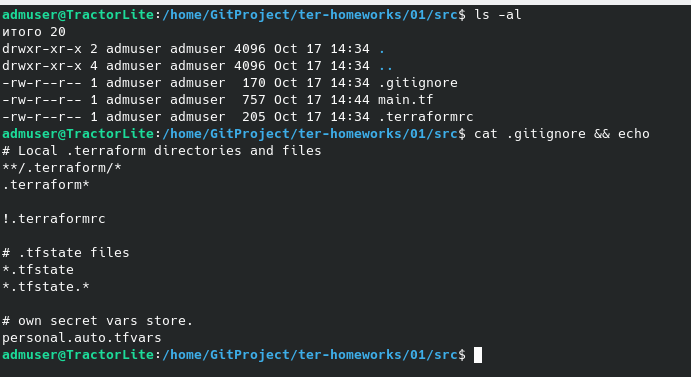
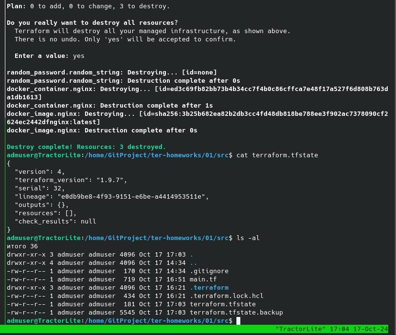

## <p style="text-align: center;">ОТЧЕТ</p> <p style="text-align: center;">по домашним заданиям к занятию «Введение в Terraform»</p>
## <p style="text-align: right;">Выполнил: студент ___________.</p>


## Чек-лист готовности к домашнему заданию

1. Скачать и установить *Terraform* версии >=1.8.4 . Приложить скриншот вывода команды `terraform --version`
2. Скачать на свой ПК этот git-репозиторий. Исходный код для выполнения задания расположен в директории 01/src.
3. Убедится, что в ОС установлен docker.

### <div style="text-align: center;">Решение</div>


## Задание 1

1. Перейдите в каталог *src*. Скачайте все необходимые зависимости, использованные в проекте.
2. Изучите файл .gitignore. В каком terraform-файле, согласно этому .gitignore, допустимо сохранить личную, секретную информацию?(логины,пароли,ключи,токены и т.д.)
3. Выполните код проекта. Найдите в state-файле секретное содержимое созданного ресурса random_password, пришлите в качестве ответа конкретный ключ и его значение.
4. Раскомментируйте блок кода, примерно расположенный на строчках 29–42 файла main.tf. Выполните команду terraform validate. Объясните, в чём заключаются намеренно допущенные ошибки. Исправьте их.
5. Выполните код. В качестве ответа приложите: исправленный фрагмент кода и вывод команды docker ps.
6. Замените имя docker-контейнера в блоке кода на hello_world. Не перепутайте имя контейнера и имя образа. Мы всё ещё продолжаем использовать name = "nginx:latest". Выполните команду terraform apply -auto-approve. Объясните своими словами, в чём может быть опасность применения ключа -auto-approve. Догадайтесь или нагуглите зачем может пригодиться данный ключ? В качестве ответа дополнительно приложите вывод команды docker ps.
7. Уничтожьте созданные ресурсы с помощью terraform. Убедитесь, что все ресурсы удалены. Приложите содержимое файла terraform.tfstate.
8. Объясните, почему при этом не был удалён docker-образ nginx:latest. Ответ ОБЯЗАТЕЛЬНО НАЙДИТЕ В ПРЕДОСТАВЛЕННОМ КОДЕ, а затем ОБЯЗАТЕЛЬНО ПОДКРЕПИТЕ строчкой из документации terraform провайдера docker. (ищите в классификаторе resource docker_image )

### <div style="text-align: center;">Решение</div>
>по пунктам 1-2
    
Для хранения секретов определен пользовательский файл personal.auto.tfvars

>по пунктам 3-5
   
# Исправленные ошибки:
1. неправильная структура `resource "docker_image"` - отсутствует пользовательское имя;
2. неправильное имя `1nginx`;
3. неправильное имя передаваемой переменной `random_password.random_string_FAKE` и  неправильный метод `resulT`.

>по пунктам 6-7


Команда `terraform apply` с ключом ***`-auto-approve`*** применяется при автоматизации процесса развертывания, когда ручное подтверждения не требуется. 



>по пунктe 8
     

### Ссылки на файлы: 
>[terraform.tfstate](./terraform.tfstate);   
>[terraform.tfstate.backup](./terraform.tfstate.backup)     


## Дополнительное задание (со звёздочкой*)
## Задание 2

1. Создать в облаке ВМ. Сделать это через web-консоль, чтобы не слить по незнанию токен от облака в github(это тема следующей лекции). Если хотите - попробуйте сделать это через terraform, прочитав документацию yandex cloud. Используйте файл personal.auto.tfvars и гитигнор или иной, безопасный способ передачи токена!
2. Подключится к ВМ по ssh и установите стек docker.
3. Найти в документации docker provider способ настроить подключение terraform на вашей рабочей станции к remote docker context вашей ВМ через ssh.
4. Используя terraform и remote docker context, скачать и запустить на  ВМ контейнер mysql:8 на порту 127.0.0.1:3306, передайте ENV-переменные. Сгенерируйте разные пароли через random_password и передайте их в контейнер, используя интерполяцию из примера с nginx.(name  = "example_${random_password.random_string.result}" , двойные кавычки и фигурные скобки обязательны!)
``` docker
    environment:
      - "MYSQL_ROOT_PASSWORD=${...}"
      - MYSQL_DATABASE=wordpress
      - MYSQL_USER=wordpress
      - "MYSQL_PASSWORD=${...}"
      - MYSQL_ROOT_HOST="%"
``` 
5. Зайти на вашу ВМ, подключится к контейнеру и проверить наличие секретных env-переменных с помощью команды env. Запишите ваш финальный код в репозиторий.

### <div style="text-align: center;">Решение</div>


## Задание 3*

1. Установить opentofu(fork terraform с лицензией Mozilla Public License, version 2.0) любой версии
2. Попробовать выполнить тот же код с помощью tofu apply, а не terraform apply.

### <div style="text-align: center;">Решение</div>

